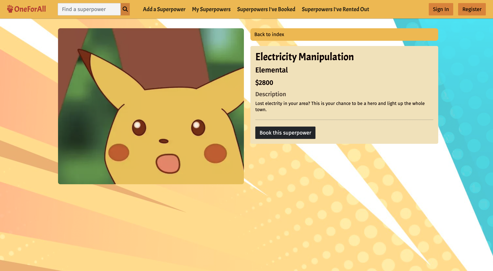
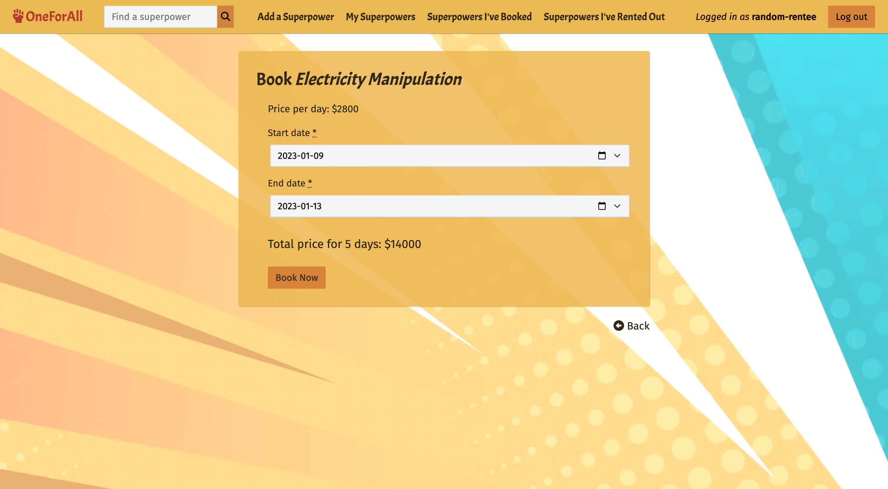
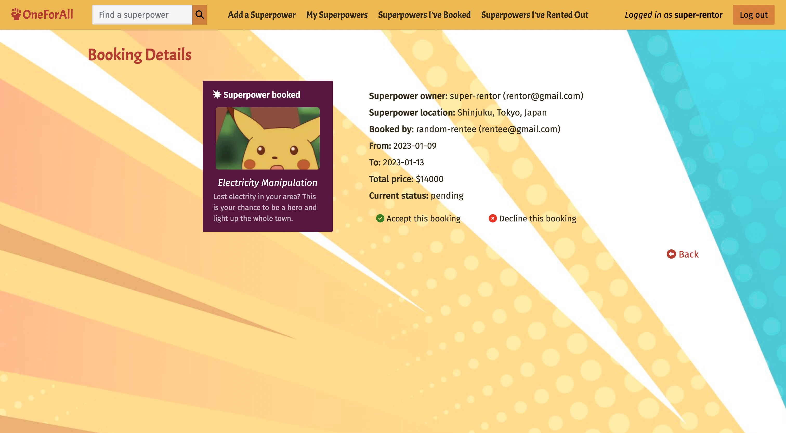

# OneForAll

A marketplace-style [web app](https://oneforall.herokuapp.com/) for superpower rental.

Created as a one-week project during the Le Wagon Montréal Bootcamp in Nov 2022.

## Features

- Superpower lookup by name, description, location or category
- Map showing location of superpowers for rent
- List or unlist superpowers as a rentor
- Book superpowers as a rentee

## Screenshots

## Authors

- [@Komezu](https://www.github.com/Komezu)
- [@redvelvet511](https://github.com/redvelvet511)
- [@nifemioyekunle](https://github.com/nifemioyekunle)

## Acknowledgements

This project uses configurations generated with [lewagon/rails-templates](https://github.com/lewagon/rails-templates), created by the [Le Wagon coding bootcamp](https://www.lewagon.com/) team.
